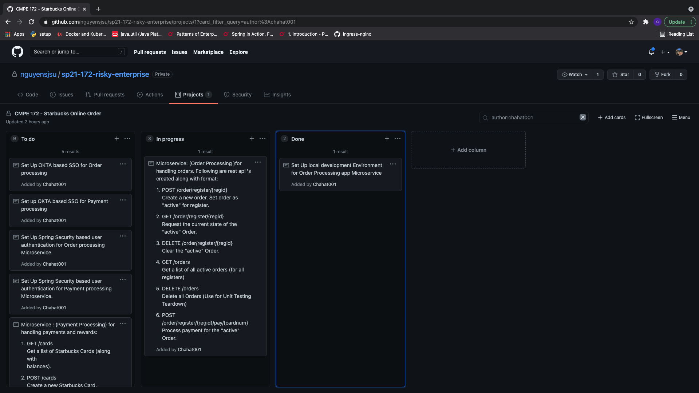

## Team Project Boad

## Challenges
1. Designing the micro-serice architecture and deciding the interaction between microservices
## Accomplishments
1. Completed Initial Deployment Design and Order Processing Microservice. Links:
    1. https://github.com/nguyensjsu/sp21-172-risky-enterprise/tree/0b37ecaf8e56a8d48a58a838b6d68d7e659f3384
    2. https://github.com/nguyensjsu/sp21-172-risky-enterprise/tree/58df9dd705c7fdf67271d1aac3e26014119af37a
    3. https://github.com/nguyensjsu/sp21-172-risky-enterprise/tree/be9c85b60f3ac22a4defdda48bca197fd8893bf1
    4. https://github.com/nguyensjsu/sp21-172-risky-enterprise/tree/60535394899a0558e241ebc31145dd40b8cf3524
    5. https://github.com/nguyensjsu/sp21-172-risky-enterprise/tree/e7ad738f3c02bcc4e509536b33e468d9f4444605
    6. https://github.com/nguyensjsu/sp21-172-risky-enterprise/tree/90e406e77820ac9450e750f8f4cd8a296a0975fc
    7. https://github.com/nguyensjsu/sp21-172-risky-enterprise/tree/f61704a3e09184419d48c49a5b05da3ae0a2755c

