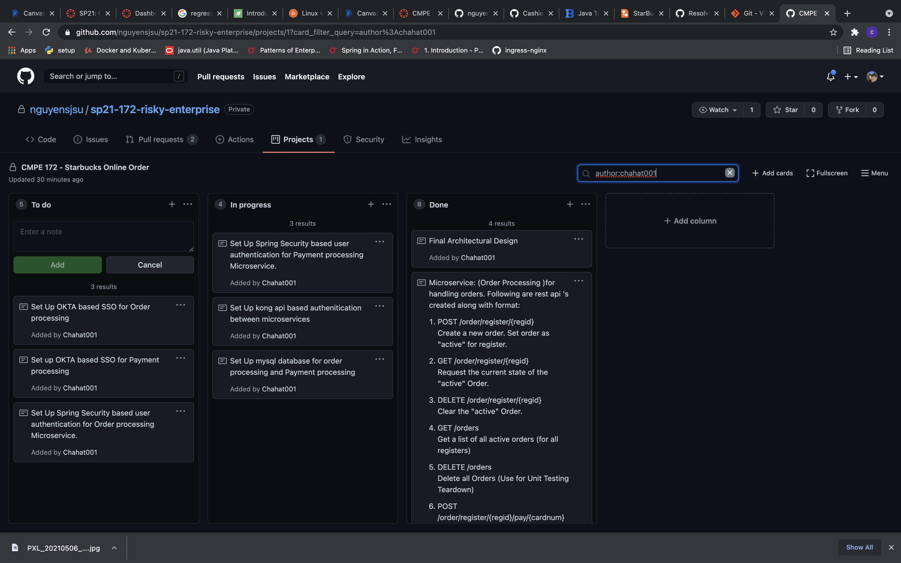

## Team Project Boad

## Challenges
1. Deciding how to set up system desing for minimal change while going from development enevironement into production.
2. Configure JPA to handle one to many and many to one  relationship in database.
3. Managing git working tree of managing many branches.
4. Considering the securoyt desing of using the same DataBase for customer authentication, and payment processing.
5. Creating successful intergation between order processing and payment processing.

## Accomplishments
1. Completed Order Processing and payment processing microservices in development environment:

    1. Info : Merge branch 'PaymentProcessing' : https://github.com/nguyensjsu/sp21-172-risky-enterprise/commit/6c7a1dd84f593cf9d6aecc17f1c39c1e8282029b
    2. Info : removed Orderprocessing files : https://github.com/nguyensjsu/sp21-172-risky-enterprise/commit/d3ff1e59ddccacc4a9a9e21fafe1e7c1ff6bf641
    3. Info : configured application-propteries for production : https://github.com/nguyensjsu/sp21-172-risky-enterprise/commit/0e5c4f9c3e3149a602ea9ff7a7a87d29505aae6b:
    4. Info : succesffu integration with paymentprocessing api : https://github.com/nguyensjsu/sp21-172-risky-enterprise/commit/12239ed7054ac32e29a91e9446eaee3473d9ed32
    5. Info : bug fixed rewards api : https://github.com/nguyensjsu/sp21-172-risky-enterprise/commit/6a2d15b694b378425994c60df1af0cb2a28e336f
    6. Info : bug fixed add reqwards and payment using rewards api : https://github.com/nguyensjsu/sp21-172-risky-enterprise/commit/72a6f0ce661f886ca4231e971dc220fd1184c316
    7. Info : bug fixed PostResponse setters and getters : https://github.com/nguyensjsu/sp21-172-risky-enterprise/commit/6e1a5210ea0e4c603e7fcd00d7f8d50f43ef9df4
    8. Info : removed gradle files : https://github.com/nguyensjsu/sp21-172-risky-enterprise/commit/d92bd25655ffc70404d820565e397e0fc94f890a
    9. Info : added git ignore file : https://github.com/nguyensjsu/sp21-172-risky-enterprise/commit/e86387432ce828aeb3da25d0dc22d489885d4752
    10. Info : integrated reward based pay using paymentprocessing api : https://github.com/nguyensjsu/sp21-172-risky-enterprise/commit/b166b365e3b4e6ab6c42528f6390e7cf85912e26
    11. Info : Created Docker dev file : https://github.com/nguyensjsu/sp21-172-risky-enterprise/commit/712520235554a50f2a64dcaf53346bfab5760aa5
    12. Info : Integration with cyber source API completed: https://github.com/nguyensjsu/sp21-172-risky-enterprise/commit/4e15e094daf6c35b1697d52780bf771bd5422ab9
    13. Info : Tested all the api's in development Environment : https://github.com/nguyensjsu/sp21-172-risky-enterprise/commit/b86e1d11593b34afa6fc99fe5a983dda71332143

