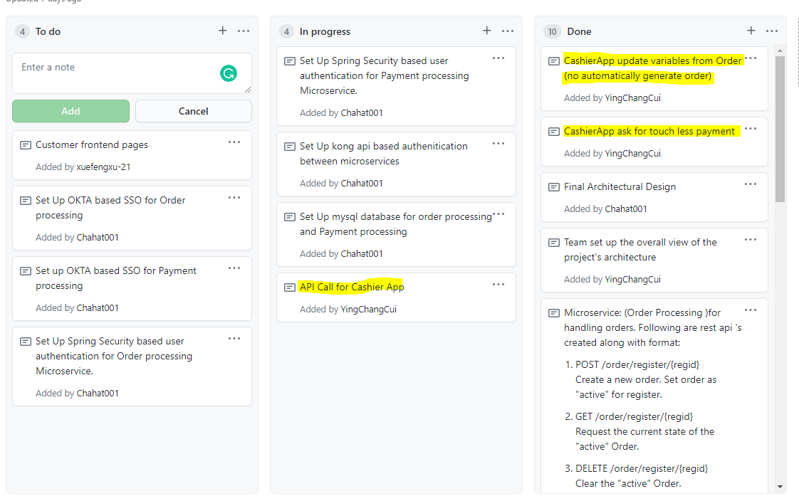

Week 4 Accomplishment:

  I made some front end changes so that each page of drinks would get the variable changes needed. I also created the payment.html that will take the payment information for
  the user. Part of the API implementation is completed and commited.
  
  List of commits:
  https://github.com/nguyensjsu/sp21-172-risky-enterprise/commit/fa5eb3e2ef9bdfed747e1cacc7c8a22e38e77c29
  https://github.com/nguyensjsu/sp21-172-risky-enterprise/commit/091490d1101aad18b18e39452543142eb58515c6
  https://github.com/nguyensjsu/sp21-172-risky-enterprise/commit/31ca2d1e4c372596f012f21e870bebb85bac161d
  
Week 4 Challenges:
  
  The only challenge I have faced was the API implementation because I havent had any experience so I had to reference Lab 7 a lot.
  
Team's Task Board:

