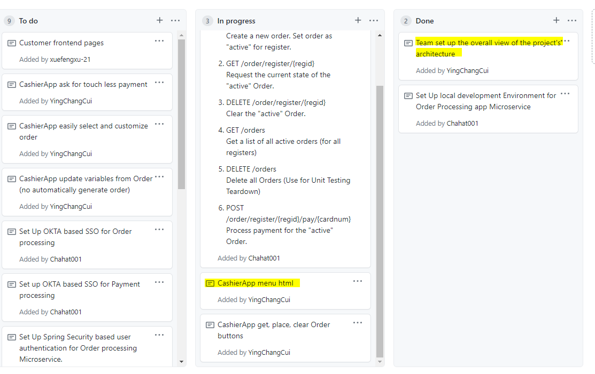

Week 1 Accomplishment:

  My team and I established our overall architecture of our entire project and made a diagram for easy understanding. My portion of the project will be mainly focused
  on the Cashier Application. So far, I have made the home page of the Cashier App which has the text and images of all the category of drinks.
  
  List of commits:
  
  https://github.com/nguyensjsu/sp21-172-risky-enterprise/commit/b2ab2e2ee88a05d8766921f146955c5f2d1788df
  
  https://github.com/nguyensjsu/sp21-172-risky-enterprise/commit/57da14262d87d6313cc862502bc2f165ee698c01
  
  https://github.com/nguyensjsu/sp21-172-risky-enterprise/commit/6903a370f90f9bb7c179c93ecc11b220dab4528f
  
  https://github.com/nguyensjsu/sp21-172-risky-enterprise/commit/4e471f0fde7c5e93fa0dd7038252bcad394614c8
  
  https://github.com/nguyensjsu/sp21-172-risky-enterprise/commit/b70fc2df688643aa98296e585b377496be6d9730

Week 1 Challenges:

  Initially, I thought we were going to be editting the nodejs file so I started working on the cashier app in nodejs and had to make the transition to spring web. Another
  challenge was learning html because I didn't have any prior experience before this class. 

Team's Task Board:

