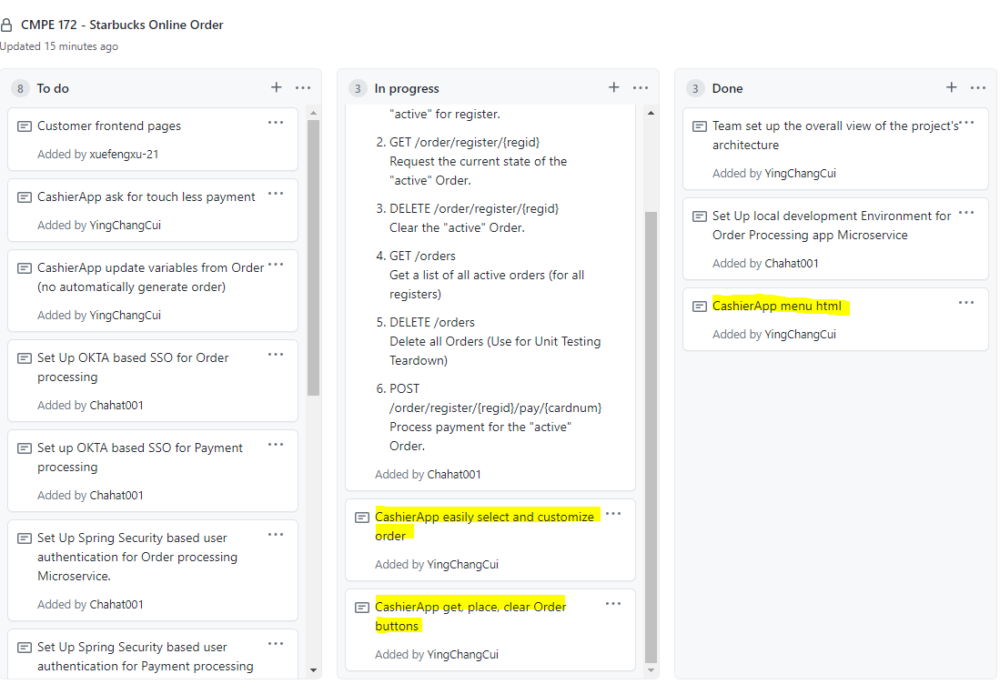

Week 2 Accomplishment:

  Throughout this week, I created new html files in which they would display all the drinks. The four categories in the html file are: Hot Coffee, Hot Tea, Hot Drinks, 
  and Frappuccino. All the images and text are updated in the html files so I can implement generating a new order next week. Another task I worked on was making a clear order
  button so I can make the API call to update all the orders in the database.
  
  List of commits:
  
  https://github.com/nguyensjsu/sp21-172-risky-enterprise/commit/f0645851b07d1c629bc311f3e3cf7f5eb8c3813a#diff-15f61c0d500b963cebfce51184f149ec3c5739f535a7b2ce6a48fe7bc6c35b1c
  
  https://github.com/nguyensjsu/sp21-172-risky-enterprise/commit/47d057fdafd714d400229e348091bafd02ae2a96#diff-15f61c0d500b963cebfce51184f149ec3c5739f535a7b2ce6a48fe7bc6c35b1c
  
Week 2 Challenges:
  
  The only challenge I faced this week was learning the html and css format so I can make all the html files for the menu display.
  
Team's Task Board:

