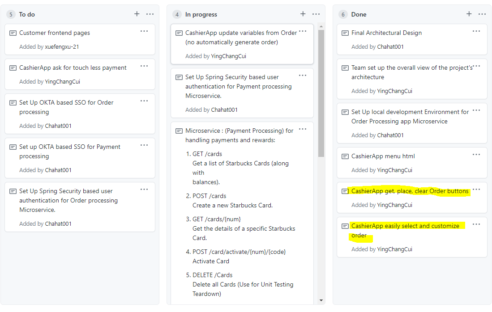

Week 3 Accomplishment:

  All the html files are finalized and the changes I made are being about to customize the order, redirect the pages so it can go into different categories and added a submit
  button so we can submit the orders to the api. I merged the cashier app branch to the main branch so I can coordinate with my teammates for the api implementation.
  
  List of commits:
  
  https://github.com/nguyensjsu/sp21-172-risky-enterprise/commit/69f5f2af96e962952d4ce02e40e786771b8c5db9
  https://github.com/nguyensjsu/sp21-172-risky-enterprise/commit/44badd527000e3edb7ee6f17ab18d9e8deb18b0d

Week 3 Challenges:
  
  The only challenge for this week was coordinating with my teammates to meet up because everyone has a different schedule so we had to reschedule a few times.
  
Team's Task Board:

