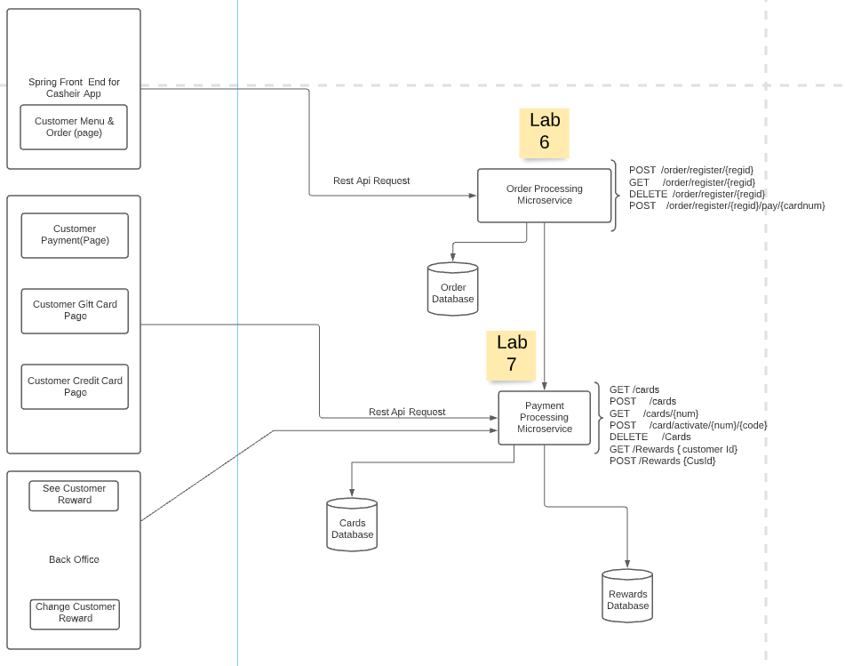
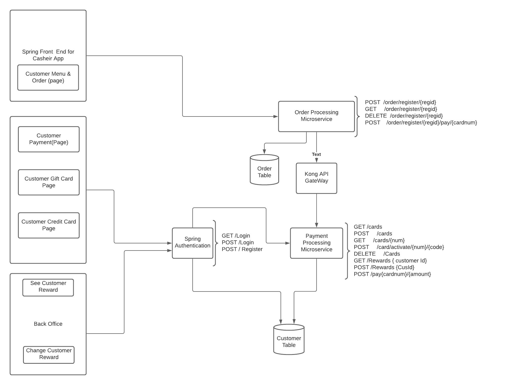

#  Risky Enterprise Team Project Journal

--- 
&nbsp;

## Team Journal

1. Cashier's App
   - What features were implemented?
2. Backoffice Help Desk App
   - What features were implemented?
3. Online Store
   - What features were implemented?
4. REST API 
   - Final design with sample request/response
5. Integrations
   - Which integrations were selected?
6. Cloud Deployments
   - Design Notes on GitHub an Architecture Diagram of the overall Deployment.
   - How does your Team's System Scale?  Can it handle > 1 Million Mobile Devices?
7. Technical Requirements
   - Discussion with screenshot evidence of how each technical requirement is meet.
8. Diagrams:
   Link for lucid Charts: https://lucid.app/lucidchart/invitations/accept/inv_4e8b2e76-cfb8-44df-b20a-448c435032e7?viewport_loc=76%2C145%2C1899%2C1068%2C0_0

   * MicroService Architecture
   

Archtecure Design 1

   

Archtecure Design 2

--- 
&nbsp;
## Meeting Journal

Mar-19: work distribution, group forming agreement
   - The project is divided into two phases (Phases 1: Cashier's App, Phase 2: Online Store), each phase consists of front-end and back-end. 
   - The four-person team will be divided into two groups. Each group member will assume different roles at different phases.

   - 

work distribution and group form

#
__Week 1__ Plan: Clearfy workflow, work assignment, and start working individually.  

Apr-22: Forming workflow diagram, and assgin work for each team members.

Apr-23: Re-formating workflow diagram.
  + current work assignments: 
    + Chahat: Order Processing Microservice
    + Ying: Casheir App 
    + Xuefeng: Customer front end.
#
__Week 2__ Plan: test Casheir App, Customer Frontend with Order Processing Microservice and start working on backoffice.  

#
__Week 3__ Plan: Test Payment processing microservice with relative frontend couple with databases 

#
__Week 4__ Plan: General testing 

