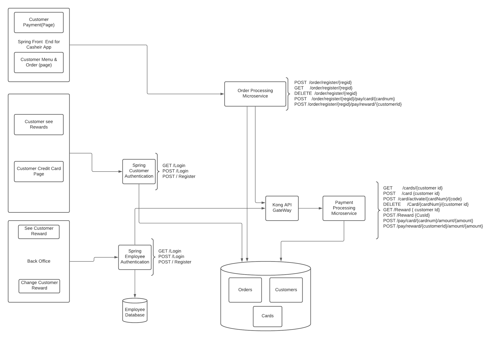

#  Risky Enterprise Team Project Journal
_By Resky Enterprise: Ying Chang Cui, Chahatpreet Grewal, Xuefeng Xu_


--- 
&nbsp; 

> Content:
> - [Project Design](#project-design)
> - [Features and Implementation](#features-and-implementation)
> - [Challenges and Solutions](#challenges-and-solutions)
> - [Roles and Contribution](#roles-and-contribution)

---

## Project Design 

Starbucks Online Order is an online order application that used by Startbuck to process customers' order, payment process, and reward management. Also, the application allows customers to review their order and reward record, and manage payment method. Our solution includes Cashier's App, Customer App, and Office App as frontends. Order Process service and Payment Process serivce as backend services connecting with different databases. 

We went through three phases of redesign before getting to out final project design that we sent into prodcution.

1. First Design

<br/>
_First Project Architecture Design_

We came up with this design after 2 hours of group meeting, where we discussed the minimal desgin for meeting the core technical requirements. We thorougly diccussed the tradeoffs, distributed the work, and considered the design desceribed in the above picture as good starting point.

Here are the key points and reasoning about out design:
* Since Orders will be placed much more frequently than others serivces like accessing rewards, inserting cards, and changanging payments details. We decided to create two sepreate micro servies. Order processing for handling orders at mutliple registers. Payment processing for handling cards, rewards, and user details. Furthemore, since intergation with cybersource api for payment using cards would have resulted in a huge code base, this design also promoted better code base maintainablity.

* Second, we agreed that we need indepenedent databases for storing Orders, Cards, and Rewards. As order database design needs to be sharded to handle high volume traffic.

<br/>
_Order_processing_DataBase_design_

Whereas databases for rewards and card needs to read intesive.

<br/>
_Rewards and Cards Database Design_

* Third, we decided on the RestAPIs to be implemeneted in order processing and payment processing:

Order Processing
   - POST  /order/register/{regid}
   - GET     /order/register/{regid}
   - DELETE  /order/register/{regid}
   - POST    /order/register/{regid}/pay/{cardnum}

Payment Processing

   - GET /cards
   - POST /cards
   - GET /cards/{num}
   - POST /card/activate/{num}/{code}
   - DELETE /cards
   - GET /Rewards {CustomerID}
   - POST /Rewards{cusID}

2. Second Design

<br/>
_Second Project Architecture Design_

After a week into a development certain flaws in our initial desing showed up. Here are the initial problems and our soltuions in new design:
* As cybersoruce API requires full cutomer and card to authorize a payment, out initial database design only store card details, thus, customer had to manually enter their full detail before paying for every order. We resolved this by creating a database design where custumer table will have one to many relationship with cards database. Furthermore, this design promoted better data noramalization and space usage as well as it could be scaled with read replicas with lazy update to meet the high read intensive loads.

* Since payment processing microservice is exposing sensitive detials through its RestAPI's we secured its API's with kong gateway, so that only authorized users with valid apikey can make a call.

* In Order to use spring security's inbuilt user authernciation support, spring authentication needs to be the part of front-end spring application that rendered the view.

* We also added api's in Payment Processing microservice for supporting payment using rewards:
   - GET /rewards{CustomerId}
   - POST /rewards{CustomerId}

3. Final Design

<br/>
_Final Project Architecture Design_

With fourth team member dropping the class, and third one struggling to keep up. We had to cut the corners that did jeopridize the overall security, scalability, and robustness of our infrastrcture to meet our technical requirements in timely manner. From the Figure, Cashier gets order with customized options directly from customer, then forward the order to Order Porcessing service. The OP service will push the order to Payment processing sevice. Customer, on the other hand, can login to the customer front end to check the order that just been placed. Also, customer could review his/her payment method, add credit card, or decide to redeem reward through the Customer fronend App. Lastly, cashier can login to office app to change the customer's reward.


Here is the final design dicussion and constraints:
1. Instead of using of database design as dicussed in Second design , we create a single MYSQL container based database that would store orders, customers, and cards. This database is a single point of failure in our infrastrcuture, and do not support scalablity and verstatility as in described in our second design.

2. With three serices using same database, the security of the whole system is comprmised. As hacker can get access to the shared database throught any of the serice.

3. Final API design is dicussed in
 > - [Features and Implementation](#features-and-implementation)


#
## Features and Implementation

1. Cashier's App
   > What features were implemented?
   - Our Cashier Application uses our orderProcessing API and the cashier can place different types of drinks (coffee, hot drinks, tea, and frappuccino).
   - Drinks can be customized by different sizes (small,medium,large) and different milk options (whole milk, nonfat milk, almond milk, and soy milk)
   - Drinks would be saved in a database through our API call (submit button). 
   - The cashier can clear orders (clear order button in home page) and it would delete all the orders from the database. 
   - The customer can for their order either by credit card or rewards. 
   - The console would receive feedback if the transaction is successful. 
   - If the transaction is successful, the database would be cleared. 
   - The cashier can also see what drinks are currently in the database to clarify what information was submitted through the API call.
2. Backoffice Help Desk App
   > What features were implemented?
   - The office app provides login feature for cahiers who want to use the app. 
   - After login, cashier would search for a paticular customer by customer ID.
   - If the customer exist, the app would display the current reward of this customer.
   - Cashier could change the reward by input a new value. The updated value would be displayed as the current reward.
  
3. Online Store
   > What features were implemented?
   - Customer can use the app as a return customer or new customer. 
   - customer can review his/her order from the order page.
   - Customer can review his/her payment methods.
   - Customer can add a new credit card for payment process.
   - Customer can review his/her current reward record and decide whether or not to use it.

4. REST API 
   > Final design of Order Processing Request/Response
   - GET /ping
     Response Body
     ```
      {
         "message": "Starbucks API version 1.0 alive!"
      }
     ```

   - POST /order/register/{regid}
      Request Body

      ```
      {
         "drink": "LATTE",
         "milk":  "WHOLE_MILK",
         "size":  "VENTI"
      }
      ```

      Response Body

      ```
      {
         "regId": 5012349,
         "drink": "LATTE",
         "milk": "WHOLE_MILK",
         "size": "VENTI",
         "price": 2.28,
         "status": "READY_FOR_PAYMENT",
         "id": 21
      }  
      ```
   
   - GET /order/register/{regid}

      Response Body

      ```
      [
         {
            "regId": 5012349,
            "drink": "LATTE",
            "milk": "WHOLE_MILK",
            "size": "VENTI",
            "price": 2.28,
            "status": "READY_FOR_PAYMENT",
            "id": 21
         },
         {
            "regId": 5012349,
            "drink": "LATTE",
            "milk": "WHOLE_MILK",
            "size": "VENTI",
            "price": 2.28,
            "status": "READY_FOR_PAYMENT",
            "id": 22
         }
      ]
      ```

   - POST /order/register/{regid}/pay/reward/{customerid}

     Response Body: if payment was successfull

      ```
         {
            "message": "SUCCESS"
         }
      ```

      Response Body: if payment was not successful

      ```
         {
            "message": "FAILURE"
         }
      ```

   - POST /order/register/{regid}/pay/card/{cardNum}

     Response Body: if payment was successfull

      ```
         {
            "message": "SUCCESS"
         }
      ```

      Response Body: if payment was not successful

      ```
         {
            "message": "FAILURE"
         }
      ```
   
   - DELETE /orders


   Response Body
   ```
     {
         "message": "deleted All orders"
     }
   ```

   > Final design of Payment Processing Request/Response

   - GET /ping
     Response Body
     ```
      {
         "msg": "Payment Processing API alive v1 !"
      }
     ```

   - POST /card/{cusId}
      Request Body

      ```
      {
         "cardNumber" : "4111111111111111",
         "expMonth": "12",
         "expYear": "2031",
         "cvv":"11",
         "cardType": "001",
         "activated": false
      }

      ```

      Response Body

      ```
      {
         "customer": 1,
         "cardNumber": "4111111111111111",
         "activated": false,
         "expMonth": "12",
         "expYear": "2031",
         "cvv": "11",
         "cardType": "001"
      }
      ```
   
   - GET /cards/{cusId}

      Response Body

      ```
      [
            {
               "customer": 1,
               "cardNumber": "4111111111111111",
               "activated": false,
               "expMonth": "12",
               "expYear": "2031",
               "cvv": "11",
               "cardType": "001"
            },
            {
               "customer": 1,
               "cardNumber": "4111111111111112",
               "activated": false,
               "expMonth": "12",
               "expYear": "2031",
               "cvv": "11",
               "cardType": "001"
            }
      ]
      ```
   - DELETE /card/{cardNum}/{customerId}

      ```
      {
         "msg": "Card Number : 4111111111111112 Deleted"
      }
      ```

   - POST /pay/card/{cardNum}/amount/{amount}

     Response Body: if payment was successfull

      ```
         {
            "message": "SUCCESS"
         }
      ```

      Response Body: if payment was not successful

      ```
         {
            "message": "FAILURE"
         }
      ```

   - POST /pay/reward/{cusId}/amount/{amount}

     Response Body: if payment was successfull

      ```
         {
            "message": "SUCCESS"
         }
      ```

      Response Body: if payment was not successful

      ```
         {
            "message": "FAILURE"
         }
      ```

   - POST /reward/{cusId}/add/{amount}

     Response Body: 

      ```
        {
            "msg": "$35.699999999999996"
        }
      ```

   - GET /rewards{cusId}

    Response Body: 

      ```
        {
            "msg": "$35.699999999999996"
        }
      ```

5. Integrations
   - CyberSource
     With CyberSource payment services, we can process payment cards (tokenized or non-tokenized), digital payments such as Apple Pay and Google Pay, and customer ID transactions. we can process payments across the globe and across multiple channels with scalability and security. CyberSource supports an extensive list of payment cards and offers a wide choice of gateways and acquiring banks, all through one connection.

     <br/>
      _Test Cards_

     We were only using the test account so we were restricted to use only limited number of cards as diplayed above.


     Here is the log of the payment request made by our system to cyber source:
     <br/>
      _Payment Logs_

6. Cloud Deployments
   - Deployment Archtecure

   <br/>
      _Deplpyment_

      
   - How does your Team's System Scale?  Can it handle > 1 Million Mobile Devices?
   
   Kuberentes is clusters are built for supporting vertical scaliblity. But uur current system design is not fully scalable. So it won't be able to handle > 1 million users. Here are the few challenges in horizantal scalling of the serices:

   1. Front-end servies  Office-front-service and Customer-front-service currently do not support sessionaffinity, therefore pods using spring authentication will not be able to work properly if scaled up. However, this can be easliy resolved by adding sessionAffinity: ClientIP in the serices specs

   2. DataBase scalling - Current database design do not support horizontal scalling, because of ACID properties of realtional database. Master to master data replicas might help with this problem.

7. Technical Requirements
   - Discussion with screenshot evidence of how each technical requirement is meet.


   * MicroService Architecture
   <details><summary>Archtecure Design 1</summary></details>
   <details><summary>Archtecure Design 2</summary></details>

--- 
&nbsp;

## Challange and Solutions
Ying Chang Cui- One challenge that I had encountered was correctly implementing the API from the Cashier Application. Initially I was not getting any feedback from
our API so it was hard to debug this issue. I was able to solve this by referencing Lab 7 when we did the payment API calls to learn how to set parameters to be passed in
and how to turn json to string and vise versa. My teammates were also very communicative so I know what parameters to be sending and receiving. The architecture we created
intially also helped me understand the overall workflow and break down the necessary steps to implement Cashier Application.

## Roles and Contributions

Ying Chang Cui: Cashier Application

Chahatpreet Grewal: Order Processing Microservice

Xuefeng Xu: Customer front end


#


## Meeting Journal

Mar-19: work distribution, group forming agreement
   - The project is divided into two phases (Phases 1: Cashier's App, Phase 2: Online Store), each phase consists of front-end and back-end. 
   - The four-person team will be divided into two groups. Each group member will assume different roles at different phases.

   - <details><summary>work distribution and group form</summary></details>
#
__Week 1__ Plan: Clearfy workflow, work assignment, and start working individually. <br/>

Apr-22: Forming workflow diagram, and assgin work for each team members.

Apr-23: Re-formating workflow diagram.
  + current work assignments: 
    + Chahat: Order Processing Microservice
    + Ying: Casheir App 
    + Xuefeng: Customer front end.
#
__Week 2__ Plan: test Casheir App, Customer Frontend with Order Processing Microservice and start working on backoffice. <br/>


#
__Week 3__ Plan: Test Payment processing microservice with relative frontend couple with databases<br/>


#
__Week 4__ Plan: General testing<br/>


